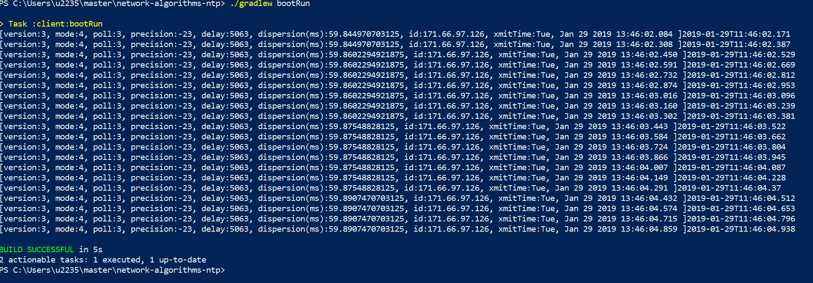

# network-algorithms-ntp
university/network-algorithms/ntp

## In order to build you need to have installed

  * Java 8

## To build and run    
   * './gradlew clean build' - to compile everything.
   * './gradlew bootRun' - to run the time client against ntp.org
  
## How it works

Client request time from ntp.org and parse real udp packets.
Round-trip network delay and local clock offset (or time drift) is calculated according to this standard NTP equation: 

```         
LocalClockOffset = ((ReceiveTimestamp - OriginateTimestamp) + 
                    (TransmitTimestamp - DestinationTimestamp)) / 2 
```

 equations from [RFC-1305](https://tools.ietf.org/html/rfc1305) (NTPv3):

```
      roundtrip delay = (t4 - t1) - (t3 - t2) 
      local clock offset = ((t2 - t1) + (t3 - t4)) / 2 
```

It takes into account network delays and assumes that they are symmetrical. 

## some screenshots
Please observe interogations of ntp.org time.
Current print does not take into account the time in between the call and current line print.
In the setup i have done this test the time error 59.87 ms

